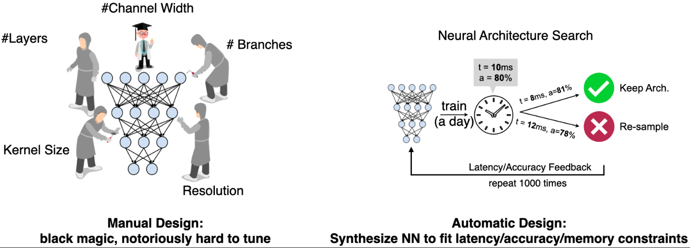
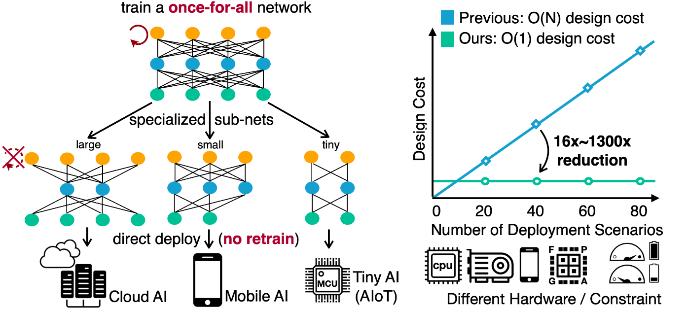
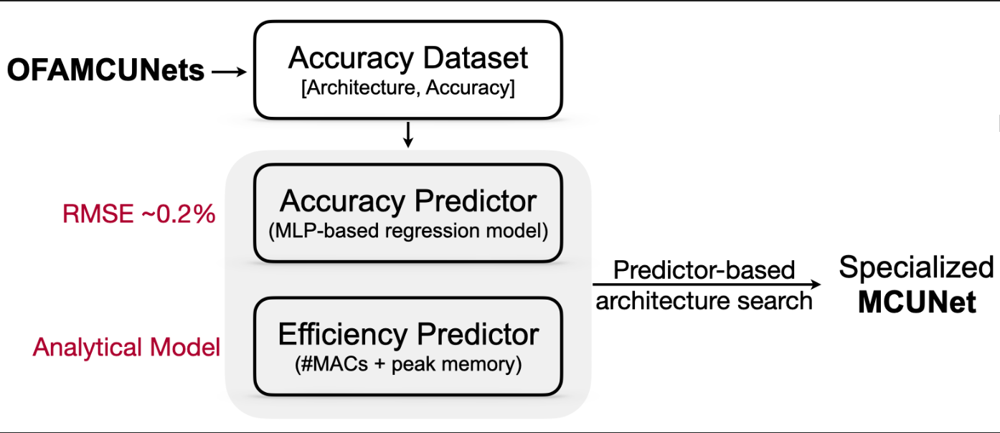

## Neural-Architecture-Search
This is a [code](./NAS_ntbk.ipynb) for search for a tiny network for microcontroller from MCUNetV2 super network.

In this repository, I have refereed to [Once for All](https://arxiv.org/abs/1908.09791) (OFA), a method that can greatly reduce the cost of specialize NN architectures for different devices. OFA trains a large **super network** that contains all **sub-networks** within the design space. If we directly extract the sub-networks from the super network, they can achieve similar-level of accuracy compared with training from scratch. As such, OFA supports direct deployment with **no retrain**.

Furthermore, OFA introduces **accuracy and efficiency predictors** to further reduce the evaluation cost during architecture search. Intuitively the accuracy of a sub-network requires running inference on the entire holdout validation set, which can take around 1 minute on ImageNet. OFA, instead, collects a large amount of (architecture, accuracy) pairs beforehand and trains a regression model to **predict** the accuracy during search. This greatly reduces the cost to get the accuracy feedback from 1 minute to less than 1 second for each sub-network. Similar idea can also be applied to efficiency predictors, where the evaluation of **latency** are usually very slow since we have to run the forward pass of the candidate network for many times.

